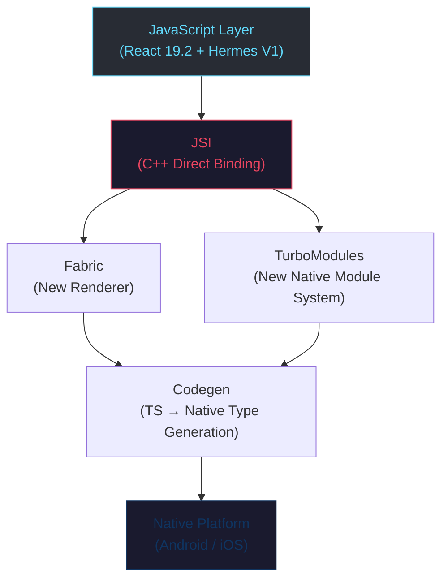

# Interactive Learning Guide 전환 계획

> **목표**: 정적 문서 읽기 중심의 Docsify 사이트를 사용자 참여형 인터랙티브 학습 플랫폼으로 전환
> **제약**: GitHub Pages 정적 호스팅 유지 (서버 없음), Docsify 프레임워크 위에서 확장
> **대상**: Kotlin Android 개발자 (기존과 동일)

---

## 1. 현재 상태 분석

### 배포 환경
| 항목 | 현재 상태 |
|------|----------|
| URL | `https://namja.github.io/React-Native-Learning-Guide/` |
| 호스팅 | GitHub Pages (main 브랜치, root `/`) |
| 프레임워크 | Docsify 4.x (CDN 기반) |
| 빌드 프로세스 | 없음 (정적 마크다운 직접 렌더링) |
| 콘텐츠 | 42개 마크다운 파일, 11개 Phase 디렉토리 |

### 현재 인터랙션 요소
- 사이드바 네비게이션
- 전체 텍스트 검색
- 이전/다음 페이지네이션
- 코드 블록 복사 버튼
- 탭 전환 (docsify-tabs)

### 문제점
1. **단방향 소비**: 사용자가 읽기만 하고 능동적으로 참여할 방법이 없음
2. **학습 확인 불가**: 체크리스트(`- [ ]`)가 있지만 실제로 체크/저장이 안 됨
3. **코드 실행 불가**: 풍부한 코드 예제가 있지만 직접 실행하거나 수정해볼 수 없음
4. **진행도 파악 불가**: 어디까지 학습했는지 추적할 수 없음
5. **시각적 단조로움**: ASCII 다이어그램만 존재, 인터랙티브 시각화 없음
6. **비교 학습 비효율**: Kotlin ↔ RN 코드 비교가 텍스트 나열로만 제공됨

---

## 2. 도입할 인터랙션 기능 목록

### 2-1. 학습 진행도 추적 시스템

**개요**: localStorage 기반으로 사용자의 학습 진행 상황을 추적하고 시각화한다.

**구현 상세**:

| 항목 | 설명 |
|------|------|
| 저장소 | `localStorage` (서버 불필요) |
| 추적 단위 | Phase별, 문서별 완료 여부 |
| UI 위치 | **페이지 상단 고정 ProgressBar** + 사이드바 상단 + 각 문서 하단 |

**기능 명세**:
- **페이지 상단 고정 ProgressBar**: 브라우저 최상단에 고정(sticky)되는 가로 진행률 바
- 각 사이드바 항목 옆에 완료 체크 아이콘 (✓) 표시
- 문서 하단에 "이 문서 학습 완료" 버튼 → 클릭 시 localStorage에 저장
- 홈 페이지(REACT_NATIVE_LEARNING_PLAN.md)에 Phase별 진행 상황 대시보드 렌더링
- 진행 데이터 JSON export/import 기능 (기기 간 이동 대비)

**상단 고정 ProgressBar 상세**:

UI 와이어프레임:
```
┌─────────────────────────────────────────────────────────────────┐
│ ██████████████████████░░░░░░░░░░░░░░░░░░░░░░░░░░  14/39 (35%)  │  ← 최상단 고정
├─────────────────────────────────────────────────────────────────┤
│ [Sidebar]  │  [Document Content]                                │
│            │                                                    │
```

기능:
- 전체 문서 수 대비 완료 문서 수를 퍼센트 + 숫자로 표시 (예: `14/39 (35%)`)
- 현재 Phase의 진행률도 별도 표시 (예: `Phase 3: 2/4`)
- 진행률 바 색상은 단계별로 변화: 0~33% `#e94560` (빨강) → 34~66% `#f5a623` (주황) → 67~99% `#61dafb` (파랑) → 100% `#4ecdc4` (민트)
- 100% 달성 시 축하 이펙트 (confetti 애니메이션)
- ProgressBar 클릭 시 Phase별 진행 현황 드롭다운 표시
- `position: sticky; top: 0; z-index: 999`로 스크롤 시에도 항상 노출
- 모바일에서는 숫자 텍스트를 숨기고 바만 표시하여 공간 절약

CSS 구현:
```css
.progress-bar-container {
  position: sticky;
  top: 0;
  z-index: 999;
  width: 100%;
  height: 36px;
  background: var(--progress-bg, #1a1a2e);
  display: flex;
  align-items: center;
  padding: 0 16px;
  box-shadow: 0 2px 8px rgba(0, 0, 0, 0.3);
  cursor: pointer;
  user-select: none;
}

.progress-bar-track {
  flex: 1;
  height: 8px;
  background: var(--progress-track, #2a2a4a);
  border-radius: 4px;
  overflow: hidden;
  margin-right: 12px;
}

.progress-bar-fill {
  height: 100%;
  border-radius: 4px;
  transition: width 0.5s ease, background-color 0.5s ease;
}

.progress-bar-text {
  font-size: 12px;
  color: var(--progress-text, #a0a0b0);
  white-space: nowrap;
  min-width: 90px;
  text-align: right;
}

/* Phase별 드롭다운 */
.progress-dropdown {
  position: absolute;
  top: 36px;
  left: 0;
  width: 100%;
  max-height: 0;
  overflow: hidden;
  background: var(--progress-bg, #1a1a2e);
  transition: max-height 0.3s ease;
  box-shadow: 0 4px 12px rgba(0, 0, 0, 0.4);
}

.progress-dropdown.open {
  max-height: 500px;
}

.progress-phase-row {
  display: flex;
  align-items: center;
  padding: 8px 16px;
  border-bottom: 1px solid var(--progress-track, #2a2a4a);
}

.progress-phase-row .phase-name {
  flex: 1;
  font-size: 13px;
}

.progress-phase-row .phase-bar {
  width: 120px;
  height: 6px;
  background: var(--progress-track, #2a2a4a);
  border-radius: 3px;
  overflow: hidden;
  margin: 0 12px;
}

/* 모바일 대응 */
@media (max-width: 768px) {
  .progress-bar-text {
    display: none;
  }
  .progress-bar-container {
    height: 28px;
    padding: 0 8px;
  }
}
```

JS 구현:
```javascript
// TOTAL_PAGES: _sidebar.md에서 파싱하거나 하드코딩 (문서 추가 시 갱신 필요)
const TOTAL_PAGES = 39; // Phase 0~10의 전체 문서 수
const PHASE_MAP = {
  'phase-00-javascript-typescript': { name: 'Phase 0: JS/TS', total: 4 },
  'phase-01-react-basics':         { name: 'Phase 1: React 기초', total: 4 },
  'phase-02-environment-setup':    { name: 'Phase 2: 환경 구축', total: 3 },
  'phase-03-core-components':      { name: 'Phase 3: 핵심 컴포넌트', total: 4 },
  'phase-04-navigation':           { name: 'Phase 4: 네비게이션', total: 4 },
  'phase-05-state-and-networking': { name: 'Phase 5: 상태/네트워크', total: 4 },
  'phase-06-new-architecture':     { name: 'Phase 6: New Arch', total: 4 },
  'phase-07-native-modules':       { name: 'Phase 7: 네이티브 모듈', total: 3 },
  'phase-08-debugging-testing':    { name: 'Phase 8: 디버깅/테스팅', total: 3 },
  'phase-09-project-deployment':   { name: 'Phase 9: 프로젝트/배포', total: 3 },
  'phase-10-advanced':             { name: 'Phase 10: 심화', total: 3 },
};

function getProgressColor(percent) {
  if (percent >= 100) return '#4ecdc4';
  if (percent >= 67)  return '#61dafb';
  if (percent >= 34)  return '#f5a623';
  return '#e94560';
}

function renderProgressBar() {
  const data = loadProgress();
  const completed = data.completedPages || [];
  const percent = Math.round((completed.length / TOTAL_PAGES) * 100);
  const color = getProgressColor(percent);

  // Phase별 완료 수 계산
  const phaseStats = {};
  for (const [dir, info] of Object.entries(PHASE_MAP)) {
    const count = completed.filter(p => p.includes(dir)).length;
    phaseStats[dir] = { ...info, completed: count };
  }

  // ProgressBar HTML 삽입
  let container = document.querySelector('.progress-bar-container');
  if (!container) {
    container = document.createElement('div');
    container.className = 'progress-bar-container';
    document.body.prepend(container);
  }

  const phaseRows = Object.entries(phaseStats).map(([dir, s]) => {
    const phasePct = Math.round((s.completed / s.total) * 100);
    return `
      <div class="progress-phase-row">
        <span class="phase-name">${s.name}</span>
        <div class="phase-bar">
          <div style="width:${phasePct}%;height:100%;background:${getProgressColor(phasePct)};border-radius:3px;"></div>
        </div>
        <span style="font-size:12px;color:#a0a0b0;min-width:50px;text-align:right;">${s.completed}/${s.total}</span>
      </div>`;
  }).join('');

  container.innerHTML = `
    <div class="progress-bar-track">
      <div class="progress-bar-fill" style="width:${percent}%;background:${color};"></div>
    </div>
    <span class="progress-bar-text">${completed.length}/${TOTAL_PAGES} (${percent}%)</span>
    <div class="progress-dropdown">${phaseRows}</div>`;

  container.onclick = () => {
    container.querySelector('.progress-dropdown').classList.toggle('open');
  };
}
```

**기술 구현**:
```javascript
// Docsify 플러그인으로 구현
window.$docsify.plugins = [].concat(function(hook, vm) {
  const STORAGE_KEY = 'rn-learning-progress';

  function loadProgress() {
    return JSON.parse(localStorage.getItem(STORAGE_KEY) || '{}');
  }

  function saveProgress(data) {
    localStorage.setItem(STORAGE_KEY, JSON.stringify(data));
  }

  hook.afterEach(function(html, next) {
    const path = vm.route.path;
    const data = loadProgress();
    const completed = data.completedPages || [];
    const isCompleted = completed.includes(path);

    const button = `
      <div class="completion-section">
        <button class="completion-btn ${isCompleted ? 'completed' : ''}"
                onclick="toggleComplete('${path}')">
          ${isCompleted ? '✅ 학습 완료!' : '📝 이 문서 학습 완료로 표시'}
        </button>
      </div>`;
    next(html + button);
  });

  window.toggleComplete = function(path) {
    const data = loadProgress();
    const completed = data.completedPages || [];
    if (completed.includes(path)) {
      data.completedPages = completed.filter(p => p !== path);
    } else {
      data.completedPages = [...completed, path];
    }
    data.lastVisited = path;
    saveProgress(data);
    location.reload();
  };

  hook.doneEach(function() {
    updateSidebarProgress();
  });
}, window.$docsify.plugins);
```

---

### 2-2. 인터랙티브 코드 Playground

**개요**: 마크다운 내 코드 블록을 브라우저에서 직접 편집·실행할 수 있는 환경을 제공한다.

**구현 상세**:

| 항목 | 설명 |
|------|------|
| JavaScript/TypeScript 실행 | 브라우저 내장 `eval` + TypeScript는 [TypeScript Compiler API (CDN)](https://www.typescriptlang.org/) 활용 |
| React/JSX 실행 | [CodeSandbox Embed](https://codesandbox.io/docs/learn/sandboxes/embedding) iframe 방식 (Sandpack은 React 컴포넌트 전용이므로 빌드 없는 Docsify 환경에서는 iframe embed 사용) |
| React Native 실행 | [Snack (Expo)](https://snack.expo.dev/) iframe 임베드 (`https://snack.expo.dev/embedded/...`) |
| 에디터 | [CodeMirror 6](https://codemirror.net/) (경량, CDN 가능) |

**적용 대상 콘텐츠**:

| Phase | Playground 유형 | 예시 |
|-------|-----------------|------|
| Phase 0 (JS/TS) | 인라인 JS/TS 실행 | 구조 분해, async/await, 고차 함수 예제 |
| Phase 1 (React) | CodeSandbox iframe 임베드 | 컴포넌트, JSX, Hooks 예제 |
| Phase 3 (Core Components) | Expo Snack 임베드 | FlatList, Flexbox, StyleSheet 예제 |
| Phase 4 (Navigation) | Expo Snack 임베드 | Stack/Tab Navigation 예제 |
| Phase 5 (State) | CodeSandbox iframe 임베드 | Zustand, TanStack Query 예제 |

**마크다운 문법 확장** (커스텀 Docsify 플러그인):
````markdown
```javascript [playground]
// 사용자가 편집 가능한 코드 블록
const greet = (name) => `Hello, ${name}!`;
console.log(greet('Android Developer'));
```

```react-native [snack]
// Expo Snack으로 임베드되는 RN 코드
import { View, Text } from 'react-native';
export default function App() {
  return <View><Text>Hello RN!</Text></View>;
}
```
````

**구현 방식**:
- Docsify 플러그인이 `[playground]` 메타 태그가 붙은 코드 블록을 감지
- 해당 블록을 CodeMirror 에디터 + 실행 버튼 + 출력 패널 UI로 교체
- `[snack]` 태그는 Expo Snack iframe으로 교체 (`https://snack.expo.dev/embedded/` URL 생성)
- `[codesandbox]` 태그는 CodeSandbox iframe으로 교체 (`https://codesandbox.io/embed/` URL 생성)
- 원본 코드 복원 "초기화" 버튼 제공

---

### 2-3. 인터랙티브 퀴즈 시스템

**개요**: 각 문서 끝에 학습 내용을 점검하는 퀴즈를 제공한다. 기존 체크리스트를 보완하는 능동적 확인 수단.

**퀴즈 유형**:

| 유형 | 설명 | 적합한 콘텐츠 |
|------|------|-------------|
| 객관식 (MCQ) | 4지선다 | 개념 이해 확인 (JSI vs Bridge 차이 등) |
| 코드 빈칸 채우기 | 코드 일부를 가리고 입력 | 문법 숙지 (Hooks, JSX 등) |
| Kotlin ↔ RN 매칭 | 드래그 앤 드롭 매칭 | Android 대응 개념 연결 |
| True/False | 참/거짓 판별 | 흔한 오해 교정 |

**마크다운 문법 확장**:
````markdown
```quiz
type: mcq
question: "React Native에서 Android의 RecyclerView에 대응하는 컴포넌트는?"
options:
  - "ScrollView"
  - "ListView"
  - "FlatList"
  - "SectionList"
answer: "FlatList"
explanation: "FlatList는 가상화(windowing)를 지원하여 RecyclerView처럼 대량 데이터를 효율적으로 렌더링합니다."
```

```quiz
type: match
question: "Android 개념과 React Native 대응을 연결하세요"
pairs:
  - ["ViewModel + StateFlow", "useState + Zustand"]
  - ["Repository + Retrofit", "TanStack Query + fetch"]
  - ["Room DB", "AsyncStorage / MMKV"]
  - ["Hilt / Koin", "React Context"]
```

```quiz
type: fill
question: "다음 빈칸을 채워 useEffect를 완성하세요"
code: |
  useEffect(() => {
    const sub = api.subscribe();
    return () => { sub.___(); };
  }, [___]);
answers: ["unsubscribe", ""]
hints: ["cleanup 함수에서 구독을 해제합니다", "빈 배열은 마운트 시 1회 실행을 의미합니다"]
```
````

**answer 규칙**: `answer` 필드는 정답 option의 **문자열 값**을 그대로 사용한다 (인덱스 아님). 파싱 시 options 배열에서 일치하는 문자열을 찾아 정답 처리한다.

**동작 방식**:
- Docsify 플러그인이 `quiz` 코드 블록을 파싱하여 인터랙티브 UI로 변환
- 정답 제출 시 즉시 피드백 (정답/오답 + 해설 표시)
- 결과를 localStorage에 저장하여 진행도 시스템과 연동
- 각 문서의 퀴즈 정답률을 사이드바에 표시 (예: `⭐ 3/5`)

---

### 2-4. Kotlin ↔ React Native 코드 비교 뷰어

**개요**: 현재 텍스트로 나열된 Kotlin/Android ↔ RN 코드 비교를 인터랙티브 side-by-side 뷰어로 전환한다.

**UI 구조**:
```
┌─────────────────────────────────────────────────────┐
│  [Kotlin/Android]  ←→  [React Native/TypeScript]    │
├────────────────────┬────────────────────────────────┤
│  val textView =    │  function Title() {            │
│    findViewById    │    return (                     │
│    <TextView>      │      <Text>Hello</Text>        │
│    (R.id.title)    │    );                           │
│  textView.text =   │  }                             │
│    "Hello"         │                                 │
├────────────────────┴────────────────────────────────┤
│  💡 Android에서는 View를 직접 찾아 조작하지만,          │
│     React에서는 상태에 따라 UI를 선언합니다.             │
└─────────────────────────────────────────────────────┘
```

**기능**:
- **Synchronized Scroll**: 좌우 코드 패널이 동기화되어 스크롤
- **Line Highlighting**: 대응하는 코드 라인을 hover 시 양쪽 동시 하이라이트
- **주석 토글**: "Android 비교 보기 / 숨기기" 버튼으로 비교 패널을 접고 펼침
- **모바일 대응**: 작은 화면에서는 탭 전환 방식으로 변환

**마크다운 문법 확장**:
````markdown
```compare
left_lang: kotlin
left_title: "Android (Kotlin)"
right_lang: typescript
right_title: "React Native (TypeScript)"
note: "명령형 vs 선언형 UI 패러다임 비교"
---left---
val textView = findViewById<TextView>(R.id.title)
textView.text = "Hello"
textView.visibility = View.GONE
---right---
function Title({ visible }: { visible: boolean }) {
  if (!visible) return null;
  return <Text>Hello</Text>;
}
```
````

---

### 2-5. 인터랙티브 다이어그램

**개요**: 기존 ASCII 아트 다이어그램을 인터랙티브 시각 다이어그램으로 교체한다.

**기술 선택**:

| 도구 | 용도 | 이유 |
|------|------|------|
| [Mermaid.js](https://mermaid.js.org/) | 플로우차트, 시퀀스 다이어그램 | Docsify 플러그인 존재, 마크다운 문법 지원 |
| 커스텀 SVG + CSS | 아키텍처 다이어그램 | 클릭 가능한 영역, 애니메이션 효과 |

**적용 대상**:

| Phase | 기존 콘텐츠 | 전환 목표 |
|-------|-----------|----------|
| Phase 1 | React 렌더링 사이클 텍스트 설명 | Mermaid 플로우차트 (State 변경 → re-render → DOM 업데이트) |
| Phase 2 | 프로젝트 구조 텍스트 트리 | 클릭 가능한 인터랙티브 파일 트리 (클릭 시 설명 팝업) |
| Phase 4 | Navigation Stack 설명 | 애니메이션 Stack push/pop 시각화 |
| Phase 5 | 상태 관리 데이터 흐름 | Mermaid 시퀀스 다이어그램 (Component → Store → API → Cache) |
| Phase 6 | New Architecture 구조도 (ASCII) | **인터랙티브 레이어 다이어그램** (각 레이어 클릭 시 상세 설명 표시) |

**Mermaid 예시 (Phase 6 아키텍처)**:
````markdown

````

---

### 2-6. 인터랙티브 체크리스트

**개요**: 기존 정적 체크리스트(`- [ ]`)를 실제로 체크 가능하고 상태가 저장되는 인터랙티브 체크리스트로 변환한다.

**동작**:
- Docsify 렌더링 후 `<li>` 내부의 체크박스(`<input type="checkbox" disabled>`)를 활성화
- 체크 상태를 localStorage에 문서 경로별로 저장
- 체크리스트 완료율을 각 문서 상단에 표시 (예: `학습 목표 달성률: 3/5 (60%)`)
- 전체 완료 시 축하 애니메이션 + "다음 Phase로" 유도

**구현**:
```javascript
hook.doneEach(function() {
  const STORAGE_KEY = 'rn-learning-progress';

  function loadProgress() {
    return JSON.parse(localStorage.getItem(STORAGE_KEY) || '{}');
  }

  function saveProgress(data) {
    localStorage.setItem(STORAGE_KEY, JSON.stringify(data));
  }

  document.querySelectorAll('.markdown-section input[type="checkbox"]').forEach((cb, i) => {
    cb.disabled = false;
    const checkKey = `${vm.route.path}:${i}`;
    const data = loadProgress();
    const checklists = data.checklists || {};
    cb.checked = checklists[checkKey] === true;

    cb.addEventListener('change', () => {
      const data = loadProgress();
      if (!data.checklists) data.checklists = {};
      data.checklists[checkKey] = cb.checked;
      saveProgress(data);
      updateChecklistProgress();
    });
  });
});
```

---

### 2-7. Flexbox 인터랙티브 Playground

**개요**: Phase 3의 Flexbox 레이아웃 학습에 특화된 시각적 Playground를 제공한다.

**UI 구조**:
```
┌─────────────────────────────────────────────────┐
│  Flexbox Playground                              │
├──────────────────┬──────────────────────────────┤
│  Controls        │  Preview                      │
│                  │  ┌──────────────────────────┐ │
│  flexDirection:  │  │  ┌─────┐ ┌─────┐        │ │
│  [column ▼]      │  │  │  1  │ │  2  │        │ │
│                  │  │  └─────┘ └─────┘        │ │
│  justifyContent: │  │  ┌─────┐                │ │
│  [flex-start ▼]  │  │  │  3  │                │ │
│                  │  │  └─────┘                │ │
│  alignItems:     │  └──────────────────────────┘ │
│  [stretch ▼]     │                               │
│                  │  Generated Code:               │
│  gap: [8px]      │  ```                           │
│                  │  style={{                       │
│  [+ Add Child]   │    flexDirection: 'column',    │
│                  │    justifyContent: 'flex-start' │
│                  │  }}                             │
│                  │  ```                           │
├──────────────────┴──────────────────────────────┤
│  Android 대응: LinearLayout(vertical) + gravity   │
└─────────────────────────────────────────────────┘
```

**기능**:
- `flexDirection`, `justifyContent`, `alignItems`, `flexWrap`, `gap` 드롭다운 조작
- 자식 요소 추가/제거, 개별 자식의 `flex`, `alignSelf` 조절
- 변경 시 실시간으로 미리보기 + RN 코드 자동 생성
- 각 속성 변경 시 대응하는 Android XML 속성 자동 표시

**구현**: 독립 HTML/JS 모듈을 Docsify 플러그인 또는 iframe으로 삽입

---

### 2-8. 다크/라이트 테마 토글

**개요**: 현재 다크 테마만 지원하므로, 사용자 선호에 따른 테마 전환 기능을 추가한다.

**구현**:
- 사이드바 상단에 🌙/☀️ 토글 버튼 배치
- CSS 커스텀 속성(variables) 기반으로 두 벌의 테마 정의
- `prefers-color-scheme` 미디어 쿼리로 시스템 설정 자동 감지
- 선택값 localStorage 저장

---

## 3. 기술 아키텍처

### 파일 구조 변경

```
React-Native-Learning-Guide/
├── index.html                    ← Docsify 설정 + 플러그인 로드
├── _sidebar.md
├── assets/
│   ├── css/
│   │   ├── theme-toggle.css      ← 다크/라이트 테마 변수
│   │   ├── playground.css        ← 코드 Playground 스타일
│   │   ├── quiz.css              ← 퀴즈 UI 스타일
│   │   ├── compare-viewer.css    ← 코드 비교 뷰어 스타일
│   │   ├── flexbox-playground.css
│   │   ├── progress.css          ← 진행도 UI 스타일 (사이드바 + 완료 버튼)
│   │   └── progress-bar.css      ← 상단 고정 ProgressBar + Phase 드롭다운
│   └── js/
│       ├── plugins/
│       │   ├── docsify-progress.js      ← 학습 진행도 추적 플러그인
│       │   ├── docsify-playground.js     ← 코드 Playground 플러그인
│       │   ├── docsify-quiz.js           ← 퀴즈 시스템 플러그인
│       │   ├── docsify-compare.js        ← 코드 비교 뷰어 플러그인
│       │   └── docsify-checklist.js      ← 인터랙티브 체크리스트 플러그인
│       └── components/
│           └── flexbox-playground.js     ← Flexbox Playground 독립 모듈
├── phase-XX-*/                   ← 기존 구조 유지 (마크다운에 quiz/playground 블록 추가)
└── ...
```

### 외부 의존성 (모두 CDN)

| 라이브러리 | 용도 | CDN 크기 | 비고 |
|-----------|------|---------|------|
| Docsify 4.x | 기본 프레임워크 | 기존 | — |
| Mermaid.js | 인터랙티브 다이어그램 | ~150KB gzip | CDN 스크립트 |
| CodeMirror 6 | 코드 에디터 (Playground) | ~130KB gzip | CDN 스크립트 |
| docsify-mermaid 플러그인 | Docsify + Mermaid 통합 | ~5KB | CDN 스크립트 |
| CodeSandbox Embed | React/JSX Playground (Phase 1, 5) | 0 (iframe) | 외부 서비스, iframe embed URL로 로드 |
| Expo Snack Embed | React Native Playground (Phase 3, 4) | 0 (iframe) | 외부 서비스, iframe embed URL로 로드 |

### 데이터 저장 구조 (localStorage)

```json
{
  "rn-learning-progress": {
    "completedPages": [
      "/phase-00-javascript-typescript/01-javascript-fundamentals",
      "/phase-01-react-basics/02-components-and-jsx"
    ],
    "checklists": {
      "/phase-01-react-basics/02-components-and-jsx:0": true,
      "/phase-01-react-basics/02-components-and-jsx:1": false
    },
    "quizResults": {
      "/phase-03-core-components/01-basic-components": { "score": 4, "total": 5 }
    },
    "theme": "dark",
    "lastVisited": "/phase-03-core-components/02-flexbox-layout",
    "version": 1
  }
}
```

---

## 4. 구현 우선순위 및 단계

### Phase A: 기반 작업 (1주)

> 모든 인터랙션의 토대가 되는 인프라 구축

| # | 작업 | 설명 |
|---|------|------|
| A-1 | `assets/` 디렉토리 구조 생성 | CSS/JS 파일 구조 셋업 |
| A-2 | 다크/라이트 테마 토글 구현 | CSS 변수 기반 테마 시스템 |
| A-3 | localStorage 유틸리티 모듈 작성 | 모든 플러그인이 공유하는 데이터 저장/로드 모듈 |
| A-4 | Docsify 플러그인 기본 구조 확립 | 플러그인 등록/초기화 패턴 표준화 |
| A-5 | index.html에 새 에셋 로드 설정 | CSS/JS 파일 로드 순서 정의 |

### Phase B: 핵심 인터랙션 (2주)

> 가장 높은 학습 효과를 제공하는 핵심 기능

| # | 작업 | 의존성 |
|---|------|--------|
| B-1 | 인터랙티브 체크리스트 플러그인 | A-3 |
| B-2 | 학습 진행도 추적 시스템 (사이드바 + 완료 버튼) | A-3, A-4 |
| B-2a | 상단 고정 ProgressBar 구현 (전체/Phase별 진행률 + 드롭다운) | A-2, A-3, B-2 |
| B-3 | Mermaid.js 다이어그램 통합 | A-5 |
| B-4 | Phase 6 (New Architecture) ASCII 다이어그램 → Mermaid 전환 | B-3 |
| B-5 | Phase 1, 5의 데이터 흐름 다이어그램 Mermaid 전환 | B-3 |

### Phase C: 코드 인터랙션 (2주)

> 코드를 직접 만져볼 수 있는 환경

| # | 작업 | 의존성 |
|---|------|--------|
| C-1 | 코드 Playground 플러그인 (JS/TS 인라인 실행) | A-4 |
| C-2 | Phase 0 (JS/TS 기초) 문서에 playground 블록 추가 | C-1 |
| C-3 | Kotlin ↔ RN 코드 비교 뷰어 플러그인 | A-4 |
| C-4 | Phase 1, 3의 비교 코드 블록을 compare 뷰어로 전환 | C-3 |
| C-5 | Expo Snack iframe 임베드 플러그인 (RN 코드 실행) | A-4 |
| C-6 | Phase 3, 4에 Snack 임베드 예제 추가 | C-5 |
| C-7 | Phase 7의 Kotlin ↔ RN 비교 코드를 compare 뷰어로 전환 | C-3 |

### Phase D: 퀴즈 & 특화 기능 (2주)

> 학습 확인 및 특화 인터랙션

| # | 작업 | 의존성 |
|---|------|--------|
| D-1 | 퀴즈 시스템 플러그인 (MCQ, True/False) | A-3, A-4 |
| D-2 | 코드 빈칸 채우기 퀴즈 유형 추가 | D-1, C-1 |
| D-3 | 매칭 퀴즈 유형 추가 (드래그 앤 드롭) | D-1 |
| D-4 | 각 Phase 문서에 퀴즈 콘텐츠 작성 (Phase 0~10 전체) | D-1, D-2, D-3 |
| D-5 | Flexbox 인터랙티브 Playground 구현 | A-4 |
| D-6 | Phase 3 Flexbox 문서에 Playground 삽입 | D-5 |

### Phase E: 통합 & 폴리싱 (1주)

| # | 작업 | 의존성 |
|---|------|--------|
| E-1 | 진행도 + 퀴즈 결과 대시보드 (홈 페이지) | B-2, D-1 |
| E-2 | 진행 데이터 export/import 기능 | B-2 |
| E-3 | 모바일 반응형 최적화 (모든 인터랙티브 요소) | All |
| E-4 | 성능 최적화 (lazy loading, CDN 캐싱) | All |
| E-5 | 크로스 브라우저 테스트 (Chrome, Safari, Firefox) | All |

---

## 5. 마크다운 콘텐츠 변경 범위

기존 마크다운 파일은 **하위 호환을 유지**하면서 인터랙티브 블록을 추가한다.
플러그인이 로드되지 않으면 일반 코드 블록으로 폴백된다.

### 변경이 필요한 파일 목록

| 파일 | 변경 내용 |
|------|----------|
| `phase-00-*/*.md` (4개) | JS/TS 코드 블록에 `[playground]` 태그 추가, 문서 끝에 퀴즈 추가 |
| `phase-01-*/*.md` (4개) | 비교 코드를 `compare` 블록으로 전환, Sandpack 예제 추가, 퀴즈 추가 |
| `phase-02-*/03-project-structure.md` | 파일 트리를 인터랙티브 트리로 전환 |
| `phase-03-*/02-flexbox-layout.md` | Flexbox Playground 삽입 |
| `phase-03-*/*.md` (4개) | Snack 임베드 예제 추가, 비교 뷰어 전환, 퀴즈 추가 |
| `phase-04-*/*.md` (4개) | Navigation 시각화 다이어그램 추가, Snack 예제 |
| `phase-05-*/*.md` (4개) | 데이터 흐름 Mermaid 다이어그램, 퀴즈 추가 |
| `phase-06-*/*.md` (4개) | ASCII 다이어그램 → Mermaid 인터랙티브 다이어그램 전환 |
| `phase-07-*/*.md` (3개) | Kotlin ↔ RN 비교 코드를 compare 뷰어로 전환, 퀴즈 추가 |
| `phase-08-*/*.md` (3개) | 퀴즈 추가 (디버깅 도구 매칭, 테스트 코드 빈칸 채우기) |
| `phase-09-*/*.md` (3개) | 퀴즈 추가 (라이브러리 선택 시나리오, 배포 절차 확인) |
| `phase-10-*/*.md` (3개) | 퀴즈 추가 (성능 최적화 전략, 애니메이션 API 선택) |
| `REACT_NATIVE_LEARNING_PLAN.md` | 진행도 대시보드 위젯 삽입 |

**변경하지 않는 파일**: `_sidebar.md`, `index.html`의 기존 설정 (추가만 함)

---

## 6. 예상 결과물 비교

| 항목 | Before | After |
|------|--------|-------|
| 코드 예제 | 읽기 전용 텍스트 + 복사 버튼 | 편집·실행 가능한 Playground |
| 다이어그램 | ASCII 아트 | 클릭 가능한 Mermaid 인터랙티브 다이어그램 |
| 체크리스트 | 정적 `[ ]` 텍스트 | 클릭 가능, 상태 저장, 진행률 표시 |
| 코드 비교 | 텍스트 나열 | Side-by-side 동기 스크롤 비교 뷰어 |
| 학습 확인 | 없음 | 퀴즈 (객관식, 빈칸 채우기, 매칭) |
| 진행 추적 | 없음 | 사이드바 프로그레스 바 + 대시보드 |
| Flexbox 학습 | 텍스트 설명 + 정적 코드 | 실시간 조작 Playground |
| 테마 | 다크 고정 | 다크/라이트 토글 |
| RN 코드 실행 | 불가 | Expo Snack 임베드로 브라우저 내 실행 |

---

## 7. 리스크 및 대응

| 리스크 | 영향 | 대응 |
|--------|------|------|
| CDN 의존성 과다로 초기 로딩 느림 | UX 저하 | Lazy loading 적용, 스크롤 시 해당 영역만 로드 |
| localStorage 용량 한계 (5~10MB) | 데이터 유실 | JSON 압축 + 주기적 정리 + export 기능 |
| Expo Snack iframe 로딩 시간 | 대기 시간 | 스켈레톤 UI + "코드 실행하기" 클릭 시에만 로드 |
| 마크다운 커스텀 문법 호환성 | Docsify 외 렌더러에서 깨짐 | 표준 코드 블록 기반으로 설계, 플러그인 없이도 코드 표시 가능 |
| 모바일 화면에서 side-by-side 비교 불가 | 레이아웃 깨짐 | 768px 이하에서 탭 전환 방식으로 자동 전환 |
