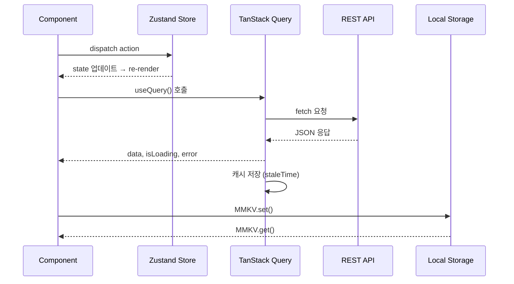

# 상태 관리 전략 — Android 아키텍처 패턴과 비교

## 목차
1. [React에서의 "상태"란?](#1-react에서의-상태란)
2. [상태의 종류](#2-상태의-종류)
3. [Android 아키텍처와의 비교](#3-android-아키텍처와의-비교)
4. [상태 관리 진화사](#4-상태-관리-진화사)
5. [언제 무엇을 사용할까](#5-언제-무엇을-사용할까)
6. [상태 관리 결정 트리](#6-상태-관리-결정-트리)
7. [MVVM 패턴 비교](#7-mvvm-패턴-비교)
8. [동일 로직의 다양한 구현 비교](#8-동일-로직의-다양한-구현-비교)

---

## 1. React에서의 "상태"란?

Android 개발에서 "상태(State)"는 ViewModel의 `StateFlow`나 `LiveData`에 담기는 데이터를 의미한다. UI가 관찰하고 있는 데이터가 변경되면 UI가 자동으로 갱신된다. React에서도 동일한 개념이지만, 용어와 구현 방식이 다르다.

**React의 핵심 원칙**: 상태가 변경되면 컴포넌트가 다시 렌더링된다.

```tsx
// Android (Kotlin + Compose)
@Composable
fun Counter() {
    var count by remember { mutableStateOf(0) }  // 상태 선언
    Button(onClick = { count++ }) {               // 상태 변경
        Text("Count: $count")                     // 상태 표시 (자동 갱신)
    }
}
```

```tsx
// React Native (TypeScript)
function Counter() {
  const [count, setCount] = useState(0);          // 상태 선언
  return (
    <TouchableOpacity onPress={() => setCount(count + 1)}> {/* 상태 변경 */}
      <Text>Count: {count}</Text>                  {/* 상태 표시 (자동 갱신) */}
    </TouchableOpacity>
  );
}
```

이 둘은 놀라울 정도로 비슷하다. `mutableStateOf` → `useState`, `by` delegate → 구조분해 할당, Recomposition → Re-render.

---

## 2. 상태의 종류

React 생태계에서는 상태를 4가지로 분류한다. 각각 Android에서의 대응 개념이 있다.

### 2-1. Local State (로컬 상태)

한 컴포넌트 내부에서만 사용하는 상태. Android에서 Fragment/Composable 내부의 UI 상태에 해당한다.

```tsx
// 예: 텍스트 입력, 드롭다운 열림/닫힘, 모달 표시 여부
function SearchBar() {
  const [query, setQuery] = useState('');         // 입력 텍스트
  const [isExpanded, setIsExpanded] = useState(false); // 확장 여부

  return (
    <View>
      <TextInput value={query} onChangeText={setQuery} />
      {isExpanded && <FilterOptions />}
    </View>
  );
}
```

Android 대응:
```kotlin
// Compose: remember { mutableStateOf() }
// View 시스템: Fragment의 지역 변수, View의 visibility
```

### 2-2. Global State (전역 상태)

여러 화면/컴포넌트에서 공유하는 상태. Android의 ViewModel(Activity 스코프) 또는 Application 스코프 상태에 해당한다.

```tsx
// 예: 로그인 사용자 정보, 테마 설정, 장바구니
// 어디서든 접근 가능해야 하는 데이터

// Zustand store 예시 (나중에 자세히 다룸)
const useCartStore = create((set) => ({
  items: [],
  addItem: (item) => set((state) => ({
    items: [...state.items, item]
  })),
}));
```

Android 대응:
```kotlin
// ViewModel + StateFlow (SharedViewModel 패턴)
// Hilt Singleton scope
// Application class의 전역 상태
```

### 2-3. Server State (서버 상태)

서버에서 가져온 데이터. 캐싱, 갱신, 동기화가 필요하다. Android의 Repository 패턴으로 관리하는 데이터에 해당한다.

```tsx
// TanStack Query 예시 (나중에 자세히 다룸)
function UserList() {
  const { data, isLoading, error } = useQuery({
    queryKey: ['users'],
    queryFn: () => fetch('/api/users').then(res => res.json()),
  });
  // 자동 캐싱, 백그라운드 갱신, 에러 처리
}
```

Android 대응:
```kotlin
// Repository + Retrofit + Room (캐싱)
// Repository에서 네트워크 vs 로컬 캐시 결정
class UserRepository(
    private val api: UserApi,        // Retrofit
    private val dao: UserDao,        // Room
) {
    fun getUsers(): Flow<List<User>> = flow {
        emit(dao.getAll())           // 캐시 먼저
        val fresh = api.getUsers()   // 네트워크 요청
        dao.insertAll(fresh)         // 캐시 업데이트
        emit(fresh)
    }
}
```

### 2-4. URL State (URL 상태)

현재 URL/경로에 담긴 상태. React Navigation에서는 `route.params`에 해당한다.

```tsx
// 네비게이션 파라미터 = URL 상태
function ProductScreen() {
  const route = useRoute();
  const { productId, category } = route.params;
  // URL: /product/42?category=electronics
}
```

Android 대응:
```kotlin
// Navigation Component의 Safe Args
// Intent extras
val productId = arguments?.getInt("productId")
```

---

## 3. Android 아키텍처와의 비교

### 3-1. 아키텍처 계층 매핑

```
Android (Clean Architecture)         React Native
──────────────────────────────      ──────────────────────────────
Presentation Layer                  Components + Hooks
├── Activity/Fragment                ├── Screen Components
├── ViewModel                        ├── Custom Hooks / Zustand Store
├── StateFlow/LiveData               ├── useState / Zustand selector
└── UI State class                   └── TypeScript interface

Domain Layer                        (보통 통합되어 있음)
├── UseCase                          ├── Custom Hooks
└── Repository Interface             └── Query/Mutation 함수

Data Layer                          API + Storage
├── Repository Impl                  ├── TanStack Query (서버 데이터)
├── Retrofit (Network)               ├── fetch / axios (네트워크)
├── Room (Local DB)                  ├── MMKV / AsyncStorage (로컬)
└── DataSource                       └── API 함수
```

### 3-2. 데이터 흐름 비교

```
Android MVVM:
User Action → ViewModel.method() → Repository → API/DB
                   ↓
            StateFlow.emit(newState)
                   ↓
            UI collects Flow → 화면 갱신

React Native:
User Action → Zustand set() / useMutation() → API/Storage
                   ↓
            Store 상태 변경 / Query 캐시 업데이트
                   ↓
            Component re-render → 화면 갱신
```

### 3-3. 의존성 주입 비교

Android에서 Hilt/Dagger를 사용한 DI는 React에서 다른 방식으로 해결된다:

```kotlin
// Android: Hilt DI
@HiltViewModel
class UserViewModel @Inject constructor(
    private val userRepository: UserRepository
) : ViewModel() {
    val users = userRepository.getUsers()
        .stateIn(viewModelScope, SharingStarted.Lazily, emptyList())
}
```

```tsx
// React: DI 대신 직접 import + Context/Hooks
// Repository 역할을 하는 커스텀 훅
function useUsers() {
  return useQuery({
    queryKey: ['users'],
    queryFn: userApi.getUsers,  // 직접 import
  });
}

// 사용처
function UserListScreen() {
  const { data: users, isLoading } = useUsers();
  // ...
}
```

React에서는 Hilt 같은 DI 프레임워크가 불필요하다. 모듈 import 시스템 자체가 DI 역할을 하고, Context가 스코핑된 값 제공 역할을 한다.

---

## 4. 상태 관리 진화사

### 4-1. setState (Class Component 시대)

```tsx
// 가장 초기 방식 — 더 이상 사용하지 않음
class Counter extends React.Component {
  state = { count: 0 };

  render() {
    return (
      <Button
        title={`Count: ${this.state.count}`}
        onPress={() => this.setState({ count: this.state.count + 1 })}
      />
    );
  }
}
```

### 4-2. Redux (2015~)

```tsx
// Redux: 중앙 집중식 상태 관리
// Android의 MVI 패턴과 유사 (단방향 데이터 흐름)
// 보일러플레이트가 많아 점점 기피됨

// actions.ts
const INCREMENT = 'INCREMENT';
const increment = () => ({ type: INCREMENT });

// reducer.ts
function counterReducer(state = { count: 0 }, action) {
  switch (action.type) {
    case INCREMENT:
      return { ...state, count: state.count + 1 };
    default:
      return state;
  }
}

// store.ts
const store = createStore(counterReducer);

// Component
function Counter() {
  const count = useSelector((state) => state.count);
  const dispatch = useDispatch();
  return <Button title={`${count}`} onPress={() => dispatch(increment())} />;
}
```

Redux의 문제점: Action 타입 상수, Action Creator, Reducer, Selector... 단순한 카운터 하나에도 이 모든 것이 필요했다. Android의 MVI 패턴이 복잡한 것과 비슷한 고충이 있었다.

### 4-3. Context API (2018~)

```tsx
// React 내장 Context: 간단한 전역 상태에 적합
// Android의 Application scope 또는 DI scope와 유사
const ThemeContext = React.createContext<'light' | 'dark'>('light');

function App() {
  const [theme, setTheme] = useState<'light' | 'dark'>('light');
  return (
    <ThemeContext.Provider value={theme}>
      <MainScreen />
    </ThemeContext.Provider>
  );
}

function SomeDeepComponent() {
  const theme = useContext(ThemeContext);
  return <Text style={{ color: theme === 'dark' ? '#fff' : '#000' }}>Hello</Text>;
}
```

Context의 한계: Provider의 value가 변경되면 **모든** Consumer가 리렌더링된다. 큰 상태 객체를 Context에 넣으면 성능 문제가 발생한다. selector 개념이 없다.

### 4-4. Zustand / Jotai / Recoil (2020~)

```tsx
// Zustand: 최소한의 API, 최대한의 기능
// Android ViewModel + StateFlow의 React 버전이라 생각하면 됨
import { create } from 'zustand';

const useCounterStore = create((set) => ({
  count: 0,
  increment: () => set((state) => ({ count: state.count + 1 })),
}));

function Counter() {
  const count = useCounterStore((state) => state.count); // selector로 구독
  const increment = useCounterStore((state) => state.increment);
  return <Button title={`${count}`} onPress={increment} />;
}
```

---

## 5. 언제 무엇을 사용할까

### 5-1. Local State (useState)

**사용 시기**: 하나의 컴포넌트에서만 사용하는 UI 상태

```tsx
// 예: 폼 입력, 토글, 드롭다운, 애니메이션 상태
function LoginForm() {
  const [email, setEmail] = useState('');
  const [password, setPassword] = useState('');
  const [showPassword, setShowPassword] = useState(false);
  const [isSubmitting, setIsSubmitting] = useState(false);
  // 이 상태들은 이 컴포넌트에서만 필요하므로 useState가 적절
}
```

Android 대응: `remember { mutableStateOf() }` 또는 Fragment의 지역 변수

### 5-2. Context

**사용 시기**: 자주 변경되지 않는 전역 값 (테마, 언어, 인증 토큰)

```tsx
// 예: 테마, 로케일 — 변경 빈도가 낮은 값
const LocaleContext = React.createContext<string>('ko');

function App() {
  const [locale, setLocale] = useState('ko');
  return (
    <LocaleContext.Provider value={locale}>
      <MainScreen />
    </LocaleContext.Provider>
  );
}
```

Android 대응: Hilt의 `@Singleton` 스코프, `Application` 클래스의 전역 설정

**주의**: 자주 변경되는 상태(예: 카운터, 폼 데이터)를 Context에 넣으면 불필요한 리렌더링이 발생한다. 이런 경우 Zustand를 사용해야 한다.

### 5-3. Zustand

**사용 시기**: 여러 화면에서 공유하는 글로벌 앱 상태

```tsx
// 예: 장바구니, 사용자 설정, 앱 전반의 UI 상태
const useCartStore = create<CartState>()((set) => ({
  items: [],
  total: 0,
  addItem: (item) => set((state) => ({
    items: [...state.items, item],
    total: state.total + item.price,
  })),
  removeItem: (id) => set((state) => ({
    items: state.items.filter(i => i.id !== id),
    total: state.items.filter(i => i.id !== id)
      .reduce((sum, i) => sum + i.price, 0),
  })),
}));
```

Android 대응: `ViewModel` + `StateFlow` (여러 Fragment에서 공유하는 SharedViewModel)

### 5-4. TanStack Query

**사용 시기**: 서버에서 가져오는 모든 데이터

```tsx
// 예: API에서 데이터 가져오기 (GET 요청)
function useProducts() {
  return useQuery({
    queryKey: ['products'],
    queryFn: () => api.get('/products').then(res => res.data),
    staleTime: 5 * 60 * 1000, // 5분간 캐시 유효
  });
}

// 예: 데이터 변경 (POST/PUT/DELETE)
function useCreateProduct() {
  const queryClient = useQueryClient();
  return useMutation({
    mutationFn: (data) => api.post('/products', data),
    onSuccess: () => queryClient.invalidateQueries({ queryKey: ['products'] }),
  });
}
```

Android 대응: `Repository` + `Retrofit` + 캐싱 로직

---

## 6. 상태 관리 결정 트리

```
이 데이터는 어디서 사용하나?
│
├─ 하나의 컴포넌트에서만? ──────────── useState
│
├─ 부모-자식 간 전달? (2~3단계) ──── props 전달
│
├─ 깊은 컴포넌트 트리에서 공유?
│   │
│   ├─ 자주 변경되는 데이터? ──────── Zustand
│   │
│   └─ 거의 변경 안 되는 데이터? ──── Context API
│       (테마, 언어, 인증 상태)
│
├─ 서버에서 오는 데이터?
│   │
│   ├─ 단순 GET 요청? ────────────── useQuery (TanStack Query)
│   │
│   ├─ POST/PUT/DELETE? ──────────── useMutation (TanStack Query)
│   │
│   └─ 무한 스크롤? ─────────────── useInfiniteQuery
│
└─ 기기 로컬에 영속적으로 저장?
    │
    ├─ 단순 키-값? ────────────────── MMKV / AsyncStorage
    │
    ├─ 관계형 데이터? ────────────── SQLite (expo-sqlite)
    │
    └─ 민감한 데이터? ────────────── SecureStore / Keystore
```

---

## 7. MVVM 패턴 비교

### 7-1. Android MVVM 구조

```kotlin
// Android MVVM 완전한 예시

// Model: 데이터 클래스
data class Product(val id: Int, val name: String, val price: Int)

// Repository: 데이터 소스 추상화
class ProductRepository @Inject constructor(
    private val api: ProductApi,
    private val dao: ProductDao,
) {
    fun getProducts(): Flow<List<Product>> = flow {
        val cached = dao.getAll()
        if (cached.isNotEmpty()) emit(cached)

        try {
            val fresh = api.getProducts()
            dao.insertAll(fresh)
            emit(fresh)
        } catch (e: Exception) {
            if (cached.isEmpty()) throw e
        }
    }
}

// ViewModel: UI 상태 관리
@HiltViewModel
class ProductViewModel @Inject constructor(
    private val repository: ProductRepository
) : ViewModel() {

    private val _uiState = MutableStateFlow<ProductUiState>(ProductUiState.Loading)
    val uiState: StateFlow<ProductUiState> = _uiState.asStateFlow()

    init {
        loadProducts()
    }

    fun loadProducts() {
        viewModelScope.launch {
            _uiState.value = ProductUiState.Loading
            repository.getProducts()
                .catch { e -> _uiState.value = ProductUiState.Error(e.message ?: "") }
                .collect { products ->
                    _uiState.value = ProductUiState.Success(products)
                }
        }
    }
}

sealed class ProductUiState {
    object Loading : ProductUiState()
    data class Success(val products: List<Product>) : ProductUiState()
    data class Error(val message: String) : ProductUiState()
}

// View (Compose)
@Composable
fun ProductListScreen(viewModel: ProductViewModel = hiltViewModel()) {
    val uiState by viewModel.uiState.collectAsStateWithLifecycle()

    when (val state = uiState) {
        is ProductUiState.Loading -> CircularProgressIndicator()
        is ProductUiState.Success -> LazyColumn {
            items(state.products) { ProductCard(it) }
        }
        is ProductUiState.Error -> ErrorMessage(state.message)
    }
}
```

### 7-2. React Native 동일 구현

```tsx
// React Native MVVM 등가 구현
// Model
type Product = {
  id: number;
  name: string;
  price: number;
};

// Repository 역할: API 함수 + TanStack Query
const productApi = {
  getProducts: (): Promise<Product[]> =>
    fetch('https://api.example.com/products').then(res => res.json()),
};

// ViewModel 역할: 커스텀 훅 (TanStack Query 사용)
function useProducts() {
  return useQuery({
    queryKey: ['products'],
    queryFn: productApi.getProducts,
    staleTime: 5 * 60 * 1000,
    // TanStack Query가 Loading, Success, Error 상태를 자동 관리
    // Android의 sealed class UiState를 직접 만들 필요 없음!
  });
}

// View: Screen 컴포넌트
function ProductListScreen() {
  const { data: products, isLoading, error, refetch } = useProducts();

  if (isLoading) {
    return <ActivityIndicator size="large" />;
  }

  if (error) {
    return <ErrorMessage message={error.message} onRetry={refetch} />;
  }

  return (
    <FlatList
      data={products}
      renderItem={({ item }) => <ProductCard product={item} />}
      keyExtractor={(item) => item.id.toString()}
    />
  );
}
```

**핵심 차이점**: Android MVVM에서 수동으로 구현하는 Loading/Success/Error 상태 관리, 캐싱, 에러 처리를 TanStack Query가 자동으로 제공한다. ViewModel + Repository + sealed class UiState 전체가 `useQuery` 한 줄로 대체된다.

---

## 8. 동일 로직의 다양한 구현 비교

"할 일 목록(Todo List)"의 추가/삭제/토글 기능을 다양한 상태 관리 방식으로 구현해 본다.

### 8-1. useState만 사용 (로컬 상태)

```tsx
// 가장 단순: 한 화면에서만 사용할 때
type Todo = { id: number; text: string; done: boolean };

function TodoScreen() {
  const [todos, setTodos] = useState<Todo[]>([]);
  const [input, setInput] = useState('');

  const addTodo = () => {
    if (!input.trim()) return;
    setTodos(prev => [
      ...prev,
      { id: Date.now(), text: input.trim(), done: false },
    ]);
    setInput('');
  };

  const toggleTodo = (id: number) => {
    setTodos(prev =>
      prev.map(todo =>
        todo.id === id ? { ...todo, done: !todo.done } : todo
      )
    );
  };

  const deleteTodo = (id: number) => {
    setTodos(prev => prev.filter(todo => todo.id !== id));
  };

  return (
    <View style={{ flex: 1, padding: 20 }}>
      <View style={{ flexDirection: 'row', marginBottom: 20 }}>
        <TextInput
          value={input}
          onChangeText={setInput}
          placeholder="할 일 입력"
          style={{ flex: 1, borderWidth: 1, padding: 10, borderRadius: 8 }}
        />
        <Button title="추가" onPress={addTodo} />
      </View>
      <FlatList
        data={todos}
        keyExtractor={(item) => item.id.toString()}
        renderItem={({ item }) => (
          <TodoItem item={item} onToggle={toggleTodo} onDelete={deleteTodo} />
        )}
      />
    </View>
  );
}
```

### 8-2. Context 사용 (여러 컴포넌트 공유)

```tsx
// 여러 컴포넌트에서 Todo에 접근해야 할 때
type TodoContextType = {
  todos: Todo[];
  addTodo: (text: string) => void;
  toggleTodo: (id: number) => void;
  deleteTodo: (id: number) => void;
};

const TodoContext = createContext<TodoContextType | null>(null);

function TodoProvider({ children }: { children: React.ReactNode }) {
  const [todos, setTodos] = useState<Todo[]>([]);

  const addTodo = (text: string) => {
    setTodos(prev => [...prev, { id: Date.now(), text, done: false }]);
  };
  const toggleTodo = (id: number) => {
    setTodos(prev => prev.map(t => t.id === id ? { ...t, done: !t.done } : t));
  };
  const deleteTodo = (id: number) => {
    setTodos(prev => prev.filter(t => t.id !== id));
  };

  return (
    <TodoContext.Provider value={{ todos, addTodo, toggleTodo, deleteTodo }}>
      {children}
    </TodoContext.Provider>
  );
}

function useTodo() {
  const context = useContext(TodoContext);
  if (!context) throw new Error('useTodo must be inside TodoProvider');
  return context;
}

// 사용하는 컴포넌트
function TodoList() {
  const { todos, toggleTodo, deleteTodo } = useTodo();
  return <FlatList data={todos} /* ... */ />;
}
```

### 8-3. Zustand 사용 (전역 상태)

```tsx
// 가장 권장: 간결하고 성능 좋음
import { create } from 'zustand';

type TodoStore = {
  todos: Todo[];
  addTodo: (text: string) => void;
  toggleTodo: (id: number) => void;
  deleteTodo: (id: number) => void;
};

const useTodoStore = create<TodoStore>((set) => ({
  todos: [],
  addTodo: (text) =>
    set((state) => ({
      todos: [...state.todos, { id: Date.now(), text, done: false }],
    })),
  toggleTodo: (id) =>
    set((state) => ({
      todos: state.todos.map((t) =>
        t.id === id ? { ...t, done: !t.done } : t
      ),
    })),
  deleteTodo: (id) =>
    set((state) => ({
      todos: state.todos.filter((t) => t.id !== id),
    })),
}));

// 사용: Provider 없이 어디서든 바로 사용!
function TodoList() {
  const todos = useTodoStore((state) => state.todos);
  const toggleTodo = useTodoStore((state) => state.toggleTodo);
  // selector로 필요한 것만 구독 → 최소 리렌더링
}

function AddTodoButton() {
  const addTodo = useTodoStore((state) => state.addTodo);
  // todos가 변경되어도 이 컴포넌트는 리렌더링되지 않음!
}
```

### 8-4. TanStack Query 사용 (서버 동기화)

```tsx
// 서버와 동기화해야 하는 경우
function useTodos() {
  return useQuery({
    queryKey: ['todos'],
    queryFn: () => api.get('/todos').then(r => r.data),
  });
}

function useAddTodo() {
  const queryClient = useQueryClient();
  return useMutation({
    mutationFn: (text: string) => api.post('/todos', { text }),
    onSuccess: () => {
      queryClient.invalidateQueries({ queryKey: ['todos'] });
    },
  });
}

function useToggleTodo() {
  const queryClient = useQueryClient();
  return useMutation({
    mutationFn: (id: number) => api.patch(`/todos/${id}/toggle`),
    onSuccess: () => {
      queryClient.invalidateQueries({ queryKey: ['todos'] });
    },
  });
}

function TodoScreen() {
  const { data: todos, isLoading } = useTodos();
  const addMutation = useAddTodo();
  const toggleMutation = useToggleTodo();

  if (isLoading) return <ActivityIndicator />;

  return (
    <FlatList
      data={todos}
      renderItem={({ item }) => (
        <TodoItem
          item={item}
          onToggle={() => toggleMutation.mutate(item.id)}
        />
      )}
    />
  );
}
```

### 8-5. 비교 요약표

| 방식 | 코드량 | 성능 | 캐싱 | 서버 동기화 | 적합한 경우 |
|------|--------|------|------|------------|------------|
| useState | 최소 | 보통 | X | X | 단일 컴포넌트 UI 상태 |
| Context | 보통 | 낮음* | X | X | 테마, 언어 등 정적 값 |
| Zustand | 최소 | 높음 | X | X | 전역 클라이언트 상태 |
| TanStack Query | 보통 | 높음 | O | O | 서버 데이터 |

*Context는 value 변경 시 모든 Consumer가 리렌더링되어 성능이 떨어질 수 있음

---

## 요약

```
Android 아키텍처                     React Native 대응
─────────────────────────────────   ─────────────────────────────
remember { mutableStateOf() }       useState()
ViewModel + StateFlow               Zustand store
SharedViewModel                     Zustand store (동일 store 공유)
Repository + Retrofit               TanStack Query + fetch/axios
Repository caching                  TanStack Query 내장 캐시
Room DAO                            MMKV / AsyncStorage / SQLite
Hilt DI @Singleton                  Context API / module import
Hilt DI @ViewModelScoped            Zustand store (생명주기 무관)
sealed class UiState                useQuery의 isLoading/error/data
viewModelScope.launch               useMutation / 비동기 action
Flow.map / combine                  Zustand selector / useMemo
```

## 📊 상태 관리 데이터 흐름



## ✅ 학습 확인 퀴즈

```quiz
type: mcq
question: "React Native에서 서버 데이터 캐싱과 동기화를 담당하는 라이브러리는?"
options:
  - "Zustand"
  - "Redux"
  - "TanStack Query"
  - "AsyncStorage"
answer: "TanStack Query"
explanation: "TanStack Query(React Query)는 서버 상태를 관리하며, 자동 캐싱, 재시도, 백그라운드 리페칭 등을 제공합니다. Retrofit + Repository 패턴을 대체합니다."
```

```quiz
type: match
question: "Android 아키텍처와 React Native 대응을 연결하세요"
pairs:
  - ["ViewModel + StateFlow", "useState + Zustand"]
  - ["Repository + Retrofit", "TanStack Query + fetch"]
  - ["Room DB", "AsyncStorage / MMKV"]
  - ["Hilt / Koin", "React Context"]
```

다음 문서에서는 Zustand를 사용한 전역 상태 관리를 상세히 다룬다.
