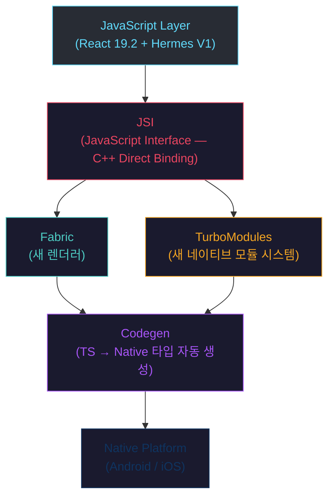

# React Native 아키텍처 전체 개요 — Android 개발자 관점

## 목차
1. [React Native의 실행 모델](#1-react-native의-실행-모델)
2. [Legacy Architecture (Bridge)](#2-legacy-architecture-bridge)
3. [New Architecture (0.82+, 0.84 기본값)](#3-new-architecture)
4. [Legacy vs New 비교표](#4-legacy-vs-new-비교표)
5. [화면 렌더링 전체 과정](#5-화면-렌더링-전체-과정)
6. [스레딩 모델 상세](#6-스레딩-모델-상세)

---

## 1. React Native의 실행 모델

### 1.1 Android의 스레드 모델 (복습)

Android 개발자라면 이미 익숙한 스레드 모델이 있다.

```
┌─────────────────────────────────────────────────┐
│                Android 스레드 모델                │
├─────────────────────────────────────────────────┤
│                                                  │
│  Main Thread (UI Thread)                         │
│  ├── View.onDraw()                              │
│  ├── Activity lifecycle callbacks                │
│  ├── onClick, onTouch handlers                  │
│  └── 16ms 안에 프레임 완성해야 함 (60fps)        │
│                                                  │
│  Worker Threads                                  │
│  ├── AsyncTask (deprecated)                     │
│  ├── Coroutine (Dispatchers.IO)                 │
│  ├── ExecutorService                            │
│  └── WorkManager (background)                   │
│                                                  │
│  RenderThread (API 21+)                          │
│  └── GPU 명령 실행, DisplayList 처리             │
│                                                  │
└─────────────────────────────────────────────────┘
```

Android에서는 `Main Thread`에서 UI를 갱신하고, 무거운 작업은 `Coroutine`이나 `Worker Thread`로 옮긴다. 16ms 안에 프레임을 완성하지 못하면 "jank"(버벅임)가 발생한다.

### 1.2 React Native의 스레드 모델

React Native는 최소 3개의 핵심 스레드를 사용한다.

```
┌─────────────────────────────────────────────────────────────────┐
│                  React Native 스레드 모델                         │
├─────────────────────────────────────────────────────────────────┤
│                                                                  │
│  JS Thread                                                       │
│  ├── JavaScript 코드 실행 (Hermes 엔진)                          │
│  ├── React 컴포넌트 렌더링 로직                                   │
│  ├── 이벤트 핸들러 (onPress, onChange 등)                         │
│  ├── 비즈니스 로직 (API 호출, 상태 관리)                           │
│  └── Android의 ViewModel + Controller 역할                       │
│                                                                  │
│  UI Thread (Main Thread = Android의 Main Thread와 동일)          │
│  ├── 네이티브 View 생성 및 업데이트                                │
│  ├── 터치 이벤트 수집                                             │
│  ├── 화면에 실제 픽셀 그리기                                       │
│  └── Android의 Main Thread와 완전히 같은 스레드                    │
│                                                                  │
│  Background Thread (Shadow Thread, NativeModules Thread)         │
│  ├── Yoga 레이아웃 계산 (Flexbox → 좌표/크기)                     │
│  ├── 네이티브 모듈 비동기 작업                                     │
│  └── Android의 Coroutine IO Dispatcher와 유사                    │
│                                                                  │
└─────────────────────────────────────────────────────────────────┘
```

### 1.3 Android ↔ React Native 스레드 매핑

| Android | React Native | 역할 |
|---------|-------------|------|
| `Main Thread` | `UI Thread` | 네이티브 뷰 렌더링, 터치 이벤트 |
| `ViewModel` + `Coroutine(Main)` | `JS Thread` | 비즈니스 로직, 상태 관리 |
| `Dispatchers.IO` / `WorkManager` | `Background Thread` | 레이아웃 계산, 비동기 작업 |
| `RenderThread` | `UI Thread` (통합) | GPU 명령 (Android에서만 분리) |
| `Choreographer` | `Fabric Scheduler` | 프레임 단위 업데이트 조율 |

**핵심 차이**: Android에서는 `Main Thread`에서 레이아웃 계산과 렌더링이 모두 일어나지만, React Native에서는 JS에서 "무엇을 보여줄지" 결정하고, Shadow Thread에서 레이아웃을 계산하고, UI Thread에서 실제 네이티브 뷰를 조작한다. 이 분리가 React Native의 핵심 설계이다.

---

## 2. Legacy Architecture (Bridge)

### 2.1 Bridge 아키텍처의 동작 방식

React Native 0.68 이전(그리고 0.82 이전 기본값)의 아키텍처는 **Bridge** 기반이었다. JS와 Native가 JSON 메시지를 주고받는 구조였다.

```
┌──────────────────────────────────────────────────────────────────┐
│                    Legacy Architecture (Bridge)                   │
├──────────────────────────────────────────────────────────────────┤
│                                                                   │
│   JS Realm                    Bridge              Native Realm    │
│  ┌──────────┐            ┌──────────┐          ┌──────────────┐  │
│  │          │  JSON 직렬화 │          │ JSON 역직렬화│            │  │
│  │  React   │ ─────────> │  Bridge  │ ────────>│  Native      │  │
│  │  (Hermes)│            │  Queue   │          │  Modules     │  │
│  │          │ <───────── │  (Async) │ <────────│              │  │
│  │          │  JSON 역직렬화│          │ JSON 직렬화│  UIManager  │  │
│  └──────────┘            └──────────┘          └──────────────┘  │
│                                                                   │
│  ┌──────────────────────────────────────────────────────────────┐ │
│  │ 메시지 예시:                                                  │ │
│  │ JS → Native: {"module":"UIManager","method":"createView",    │ │
│  │   "args":[42,"RCTView",1,{"backgroundColor":"red"}]}         │ │
│  │                                                               │ │
│  │ Native → JS: {"module":"EventEmitter","method":"emit",       │ │
│  │   "args":["topChange",{"target":42,"text":"hello"}]}         │ │
│  └──────────────────────────────────────────────────────────────┘ │
│                                                                   │
└──────────────────────────────────────────────────────────────────┘
```

### 2.2 Bridge의 동작 흐름 (단계별)

사용자가 버튼을 누르면 어떻게 되는지 단계별로 보자:

```
사용자 터치
    │
    ▼
[UI Thread] 터치 이벤트 감지
    │
    ▼ (JSON 직렬화)
[Bridge Queue] {"type":"touch","target":15,"x":120,"y":340}
    │
    ▼ (비동기, 배치 처리)
[JS Thread] onPress 핸들러 실행 → setState → React 리렌더링
    │
    ▼ (JSON 직렬화)
[Bridge Queue] [
    {"module":"UIManager","method":"updateView","args":[15,{"text":"Pressed!"}]},
    {"module":"UIManager","method":"createView","args":[42,"RCTView",...]},
    ...
]
    │
    ▼ (비동기, 배치 처리)
[UI Thread] 네이티브 뷰 업데이트
    │
    ▼
화면에 반영 (다음 프레임)
```

### 2.3 Bridge의 문제점

**문제 1: 비동기 전용 통신**

```
Android 비유:
  Handler(Looper.getMainLooper()).post {
      // 다음 루프에서 실행됨 — 즉시 결과를 얻을 수 없음
  }

이것이 Bridge의 모든 통신이었다.
동기적으로 "지금 당장 결과를 줘"라고 할 수 없었다.
```

모든 JS ↔ Native 통신이 비동기적이었기 때문에:
- 터치 이벤트 응답에 최소 1 프레임(16ms) 지연
- 스크롤 중 JS에서 뷰 위치를 동기적으로 읽을 수 없음
- "화면이 뚝뚝 끊기는" 느낌의 원인

**문제 2: JSON 직렬화/역직렬화 오버헤드**

```
JS 객체 → JSON.stringify() → 문자열 전송 → JSON.parse() → Native 객체

매 프레임마다 이 과정이 반복됨:
- CPU 사용량 증가 (파싱 비용)
- 메모리 할당/해제 빈번 (GC 압박)
- 복잡한 데이터일수록 느려짐

Android 비유:
  모든 함수 호출을 Intent에 JSON으로 담아 sendBroadcast()하는 것과 비슷
  직접 함수를 호출하면 될 것을... 매번 직렬화/역직렬화
```

**문제 3: 메모리 공유 불가**

```
JS 메모리 공간         Native 메모리 공간
┌──────────────┐      ┌──────────────┐
│ { data: ... }│ ──X──│ Object data  │
│              │      │              │
│ 완전히 분리된 │      │ 완전히 분리된 │
│ 힙 메모리     │      │ 힙 메모리     │
└──────────────┘      └──────────────┘

이미지를 처리하려면?
→ 바이트 배열을 JSON 문자열로 변환 → 전송 → 다시 바이트로 변환
→ 엄청난 오버헤드!
```

**문제 4: 단일 스레드 직렬 처리**

Bridge는 단일 큐였기 때문에, 한 모듈의 대량 통신이 다른 모듈의 메시지를 막을 수 있었다:

```
Bridge Queue: [msg1, msg2, msg3, ... msg999, criticalUIUpdate]
                                                    ↑
                                            이 메시지가 999개 뒤에서 대기중
                                            → UI 업데이트 지연 → 버벅임
```

**문제 5: 타입 안전성 부재**

```typescript
// JS에서 호출
NativeModules.MyModule.doSomething("hello", 42);

// Native에서 수신 — 타입이 보장되지 않음!
// 잘못된 타입을 보내면 런타임 크래시
@ReactMethod
fun doSomething(text: String, count: Int) { ... }
// → JS에서 doSomething(42, "hello")로 호출해도 컴파일 에러 없음
```

---

## 3. New Architecture

### 3.1 New Architecture 전체 구조

React Native 0.82부터 New Architecture가 기본값이며, 0.84에서는 완전히 안정화되었다.

```
┌──────────────────────────────────────────────────────────────────────┐
│                     New Architecture (0.84)                          │
├──────────────────────────────────────────────────────────────────────┤
│                                                                      │
│  ┌──────────┐       ┌─────────────┐        ┌───────────────┐        │
│  │          │  JSI   │             │        │               │        │
│  │  React   │◄─────►│   C++ Host  │◄──────►│  TurboModules │        │
│  │  (Hermes)│ 직접   │   Objects   │ 직접    │  (Kotlin/C++) │        │
│  │          │ 참조   │             │ 호출    │               │        │
│  └────┬─────┘       └──────┬──────┘        └───────────────┘        │
│       │                    │                                         │
│       │ React Tree         │ Shadow Tree                             │
│       ▼                    ▼                                         │
│  ┌──────────┐       ┌─────────────┐        ┌───────────────┐        │
│  │  React   │       │   Fabric    │        │  Native View  │        │
│  │Reconciler│──────►│  Renderer   │───────►│    Tree       │        │
│  │          │       │  + Yoga     │        │  (Android UI) │        │
│  └──────────┘       └─────────────┘        └───────────────┘        │
│                                                                      │
│  ┌──────────────────────────────────────────────────────────────┐    │
│  │  Codegen (빌드 시)                                            │    │
│  │  TypeScript Spec → C++ Interface → Kotlin/Java Stub          │    │
│  │  → 타입 안전성 보장, 런타임 에러 방지                           │    │
│  └──────────────────────────────────────────────────────────────┘    │
│                                                                      │
└──────────────────────────────────────────────────────────────────────┘
```

### 3.2 JSI (JavaScript Interface)

JSI는 Bridge를 대체하는 **C++ 기반 인터페이스**이다. JSON 직렬화 없이 JS와 Native가 직접 통신한다.

```
Legacy (Bridge):
  JS 객체 → JSON.stringify → 문자열 → JSON.parse → Native 객체
  (복사, 직렬화, 큐 대기, 역직렬화)

New (JSI):
  JS 객체 → C++ Host Object → Native 객체
  (직접 참조, 복사 없음, 동기 가능)
```

**Android 개발자를 위한 비유**:

```
Bridge = AIDL을 통한 프로세스 간 통신 (IPC)
  - 데이터를 Parcel에 직렬화
  - Binder를 통해 전송
  - 받는 쪽에서 역직렬화
  - 느리고 비용이 큼

JSI = 같은 프로세스 내 직접 함수 호출
  - 포인터로 객체에 직접 접근
  - 함수를 직접 호출
  - 결과를 즉시 반환
  - 빠르고 오버헤드 최소
```

JSI의 핵심 개념 — HostObject:

```cpp
// C++ 레벨에서 JS에 노출되는 객체
class MyNativeObject : public jsi::HostObject {
  jsi::Value get(jsi::Runtime& rt, const jsi::PropNameID& name) override {
    if (name.utf8(rt) == "greeting") {
      return jsi::String::createFromUtf8(rt, "Hello from C++!");
    }
    return jsi::Value::undefined();
  }
};
```

```javascript
// JS에서 직접 접근 — Bridge 없이!
const obj = global.__myNativeObject;
console.log(obj.greeting); // "Hello from C++!" — 동기적으로 즉시 반환
```

### 3.3 Fabric (새로운 렌더링 시스템)

Fabric은 Legacy Renderer를 대체하는 새로운 렌더링 시스템이다.

```
┌──────────────────────────────────────────────────────────────────┐
│                    Fabric 렌더링 파이프라인                        │
├──────────────────────────────────────────────────────────────────┤
│                                                                   │
│  Phase 1: Render (JS Thread)                                      │
│  ┌─────────────────────────────────────┐                         │
│  │ JSX → React Element Tree            │                         │
│  │ <View style={{flex:1}}>             │                         │
│  │   <Text>Hello</Text>                │                         │
│  │ </View>                             │                         │
│  └──────────────┬──────────────────────┘                         │
│                 │                                                  │
│  Phase 2: Commit (Background Thread)                              │
│  ┌──────────────▼──────────────────────┐                         │
│  │ Shadow Tree 생성 + Yoga 레이아웃     │                         │
│  │ ShadowNode(View, flex:1)            │                         │
│  │   └─ ShadowNode(Text, "Hello")      │                         │
│  │ Yoga: x=0,y=0,w=1080,h=1920        │                         │
│  │       x=0,y=0,w=200,h=48           │                         │
│  └──────────────┬──────────────────────┘                         │
│                 │                                                  │
│  Phase 3: Mount (UI Thread)                                       │
│  ┌──────────────▼──────────────────────┐                         │
│  │ Native View Tree 생성/업데이트       │                         │
│  │ android.view.View(0,0,1080,1920)    │                         │
│  │   └─ android.widget.TextView        │                         │
│  │       "Hello" at (0,0,200,48)       │                         │
│  └─────────────────────────────────────┘                         │
│                                                                   │
└──────────────────────────────────────────────────────────────────┘
```

**Fabric vs Legacy Renderer 비교**:

| 항목 | Legacy Renderer | Fabric |
|------|----------------|--------|
| 통신 | Bridge (비동기) | JSI (동기 가능) |
| 레이아웃 | Shadow Thread에서만 | 어떤 스레드에서든 가능 |
| 트리 비교 | JS 쪽에서만 diff | C++ 레벨에서 diff |
| 동시성 | 불가 | React 19 Concurrent 지원 |
| 우선순위 | 없음 | 긴급/일반 업데이트 구분 |

### 3.4 TurboModules (새로운 네이티브 모듈 시스템)

Legacy Native Modules와 TurboModules의 차이:

```
┌────────────────────────────────────────────────────────────────┐
│              Legacy Native Modules                              │
├────────────────────────────────────────────────────────────────┤
│                                                                 │
│  앱 시작 시 → 모든 Native Module 초기화                          │
│  ┌──────┐ ┌──────┐ ┌──────┐ ┌──────┐ ┌──────┐                 │
│  │Camera│ │Bluetooth│ │GPS │ │NFC  │ │Share │                 │
│  └──────┘ └──────┘ └──────┘ └──────┘ └──────┘                 │
│  전부 초기화 (사용 여부 관계없이) → 시작 시간 증가                  │
│                                                                 │
├────────────────────────────────────────────────────────────────┤
│              TurboModules                                       │
├────────────────────────────────────────────────────────────────┤
│                                                                 │
│  앱 시작 시 → 아무것도 초기화하지 않음                             │
│  처음 사용할 때 → 해당 모듈만 초기화 (Lazy Loading)               │
│                                                                 │
│  Camera 사용 시점 → ┌──────┐ 이때 초기화                         │
│                     │Camera│                                    │
│                     └──────┘                                    │
│  GPS 사용 시점 →    ┌──────┐ 이때 초기화                         │
│                     │ GPS  │                                    │
│                     └──────┘                                    │
│  나머지 → 사용 안 하면 초기화하지 않음 → 시작 시간 단축             │
│                                                                 │
└────────────────────────────────────────────────────────────────┘
```

**Android 비유**: TurboModules의 Lazy Loading은 Dagger/Hilt의 `@Inject lateinit var`와 유사하다. 필요할 때 처음 접근하면 그때 인스턴스가 생성된다. Legacy는 `Application.onCreate()`에서 모든 것을 초기화하는 것과 같았다.

### 3.5 Codegen (타입 안전 코드 생성)

```
┌────────────────────────────────────────────────────────────────┐
│                      Codegen 흐름                               │
├────────────────────────────────────────────────────────────────┤
│                                                                 │
│  개발자가 작성:                                                  │
│  ┌──────────────────────────────────────┐                      │
│  │ // NativeCalendar.ts                 │                      │
│  │ export interface Spec extends        │                      │
│  │   TurboModule {                      │                      │
│  │   getEvents(date: string):           │                      │
│  │     Promise<Object[]>;               │                      │
│  │ }                                    │                      │
│  └──────────────┬───────────────────────┘                      │
│                 │                                                │
│  Codegen 실행 (빌드 시 자동):                                    │
│                 │                                                │
│                 ▼                                                │
│  ┌──────────────────────────────────────┐                      │
│  │ // 자동 생성: C++ Header             │                      │
│  │ class JSI_EXPORT NativeCalendarSpec  │                      │
│  │   : public TurboModule {            │                      │
│  │   virtual AsyncPromise<jsi::Array>   │                      │
│  │     getEvents(jsi::String date) = 0; │                      │
│  │ };                                   │                      │
│  └──────────────┬───────────────────────┘                      │
│                 │                                                │
│                 ▼                                                │
│  ┌──────────────────────────────────────┐                      │
│  │ // 자동 생성: Kotlin Abstract Class  │                      │
│  │ abstract class NativeCalendarSpec(   │                      │
│  │   reactContext: ReactApplicationCtx  │                      │
│  │ ) : NativeCalendarSpec {             │                      │
│  │   abstract fun getEvents(            │                      │
│  │     date: String                     │                      │
│  │   ): WritableArray // ← 타입 강제!   │                      │
│  │ }                                    │                      │
│  └──────────────────────────────────────┘                      │
│                                                                 │
│  개발자가 구현:                                                  │
│  ┌──────────────────────────────────────┐                      │
│  │ class NativeCalendarModule(ctx) :    │                      │
│  │   NativeCalendarSpec(ctx) {          │                      │
│  │   override fun getEvents(date: String)│                     │
│  │     : WritableArray {                │                      │
│  │     // 컴파일러가 타입 검증!          │                      │
│  │   }                                  │                      │
│  │ }                                    │                      │
│  └──────────────────────────────────────┘                      │
│                                                                 │
└────────────────────────────────────────────────────────────────┘
```

---

## 4. Legacy vs New 비교표

| # | 비교 항목 | Legacy (Bridge) | New Architecture | 비고 |
|---|----------|----------------|-----------------|------|
| 1 | **JS ↔ Native 통신** | JSON 직렬화 (비동기) | JSI 직접 참조 (동기/비동기) | 통신 비용 10배 이상 감소 |
| 2 | **렌더링 시스템** | Legacy Renderer | Fabric | 3단계 파이프라인으로 분리 |
| 3 | **네이티브 모듈** | NativeModule (Bridge 경유) | TurboModule (JSI 직접) | Lazy loading 지원 |
| 4 | **모듈 초기화** | 앱 시작 시 전부 로드 | 사용 시 지연 로드 | 시작 시간 30~50% 단축 |
| 5 | **타입 안전성** | 없음 (런타임 크래시) | Codegen으로 컴파일 타임 검증 | TS spec → C++ 인터페이스 |
| 6 | **동시성 렌더링** | 불가능 | React 19 Concurrent 지원 | useTransition, Suspense |
| 7 | **레이아웃 계산** | Shadow Thread 전용 | 어떤 스레드에서든 가능 | 동기 측정 가능 |
| 8 | **메모리 공유** | 불가 (복사만) | JSI로 공유 가능 | 이미지/바이너리 데이터 효율적 |
| 9 | **이벤트 처리** | 배치 → 큐 → JS | 직접 전달 가능 | 터치 반응 지연 감소 |
| 10 | **앱 시작 속도** | 느림 (모듈 전부 초기화) | 빠름 (Lazy + Hermes bytecode) | Cold start 개선 |
| 11 | **스크롤 성능** | 자주 끊김 (Bridge 병목) | 부드러움 (직접 통신) | FlatList 성능 크게 향상 |
| 12 | **디버깅** | Chrome DevTools (V8) | Hermes debugger / Flipper | Hermes로 일관된 실행 환경 |
| 13 | **C++ 코드 공유** | 불가 | JSI로 C++ 직접 호출 가능 | iOS/Android 로직 공유 |
| 14 | **에러 메시지** | 불분명 (직렬화 중 소실) | 타입 정보 포함, 명확 | Codegen 덕분 |

---

## 5. 화면 렌더링 전체 과정

### 5.1 JSX에서 네이티브 View까지: 단계별 추적

아래 간단한 컴포넌트가 화면에 나타나기까지의 전체 과정을 추적한다:

```tsx
function Greeting() {
  const [name, setName] = useState('World');
  return (
    <View style={styles.container}>
      <Text style={styles.text}>Hello, {name}!</Text>
      <Button title="Change" onPress={() => setName('React Native')} />
    </View>
  );
}

const styles = StyleSheet.create({
  container: { flex: 1, justifyContent: 'center', alignItems: 'center' },
  text: { fontSize: 24, color: '#333' },
});
```

```
┌──────────────────────────────────────────────────────────────────┐
│            전체 렌더링 과정 (New Architecture + Fabric)            │
├──────────────────────────────────────────────────────────────────┤
│                                                                   │
│  Step 1: JSX → React Element (JS Thread)                         │
│  ┌────────────────────────────────────────────┐                  │
│  │ React.createElement(View, {style:...},     │                  │
│  │   React.createElement(Text, {}, "Hello"),  │                  │
│  │   React.createElement(Button, {title:...}) │                  │
│  │ )                                          │                  │
│  │ → 순수 JavaScript 객체 트리 생성           │                  │
│  └──────────────────┬─────────────────────────┘                  │
│                     │                                             │
│  Step 2: Reconciliation — Fiber Tree 구축 (JS Thread)            │
│  ┌──────────────────▼─────────────────────────┐                  │
│  │ React Reconciler가 이전 트리와 비교(diff)   │                  │
│  │ 변경된 부분만 식별                          │                  │
│  │                                             │                  │
│  │ FiberNode(View)                             │                  │
│  │   ├── FiberNode(Text, "Hello, World!")      │                  │
│  │   └── FiberNode(Button, "Change")           │                  │
│  └──────────────────┬─────────────────────────┘                  │
│                     │                                             │
│  Step 3: Fabric → Shadow Tree 생성 (C++ 레이어)                  │
│  ┌──────────────────▼─────────────────────────┐                  │
│  │ JSI를 통해 C++ Shadow Tree 직접 생성        │                  │
│  │ (Bridge 없이 즉시!)                         │                  │
│  │                                             │                  │
│  │ ShadowNode(View, flex:1, center, center)    │                  │
│  │   ├── ShadowNode(RawText, "Hello, World!")  │                  │
│  │   └── ShadowNode(Button, "Change")          │                  │
│  └──────────────────┬─────────────────────────┘                  │
│                     │                                             │
│  Step 4: Yoga 레이아웃 계산 (Background or UI Thread)            │
│  ┌──────────────────▼─────────────────────────┐                  │
│  │ Yoga 엔진이 Flexbox → 절대 좌표/크기 변환   │                  │
│  │                                             │                  │
│  │ View:   x=0,   y=0,   w=1080, h=2340      │                  │
│  │ Text:   x=390, y=1146, w=300,  h=48        │                  │
│  │ Button: x=415, y=1210, w=250,  h=56        │                  │
│  │                                             │                  │
│  │ (Android의 View.measure() + layout()과 동일)│                  │
│  └──────────────────┬─────────────────────────┘                  │
│                     │                                             │
│  Step 5: Mount — 네이티브 View 생성 (UI Thread)                  │
│  ┌──────────────────▼─────────────────────────┐                  │
│  │ Android 네이티브 뷰 생성 및 배치             │                  │
│  │                                             │                  │
│  │ android.view.ViewGroup (0,0,1080,2340)      │                  │
│  │   ├── android.widget.TextView               │                  │
│  │   │   text="Hello, World!"                  │                  │
│  │   │   textSize=24sp, color=#333             │                  │
│  │   │   layout(390,1146,690,1194)             │                  │
│  │   └── android.widget.Button                 │                  │
│  │       text="Change"                         │                  │
│  │       layout(415,1210,665,1266)             │                  │
│  └──────────────────┬─────────────────────────┘                  │
│                     │                                             │
│  Step 6: Draw — 화면에 표시 (GPU)                                │
│  ┌──────────────────▼─────────────────────────┐                  │
│  │ Android RenderThread가 DisplayList 실행     │                  │
│  │ → GPU에서 픽셀 렌더링 → 화면 출력           │                  │
│  └────────────────────────────────────────────┘                  │
│                                                                   │
└──────────────────────────────────────────────────────────────────┘
```

### 5.2 업데이트 발생 시 (setState)

사용자가 "Change" 버튼을 누르면:

```
┌──────────────────────────────────────────────────────────────────┐
│              상태 업데이트 시 렌더링 과정                           │
├──────────────────────────────────────────────────────────────────┤
│                                                                   │
│  1. 터치 이벤트 → onPress 핸들러 실행 (JS Thread)                 │
│     setName('React Native')                                      │
│                                                                   │
│  2. React Reconciler가 새 트리와 기존 트리 비교                    │
│     이전: Text("Hello, World!")                                   │
│     이후: Text("Hello, React Native!")                            │
│     → Text 노드만 변경됨을 식별                                    │
│                                                                   │
│  3. Fabric이 Shadow Tree diff 계산 (C++)                          │
│     변경: ShadowNode(Text) 텍스트 업데이트                         │
│     Yoga: 텍스트 크기 변경 → 레이아웃 재계산                       │
│     Text: x=340, y=1146, w=400, h=48  (폭이 넓어짐)              │
│                                                                   │
│  4. Mount 단계에서 변경된 뷰만 업데이트 (UI Thread)                │
│     textView.text = "Hello, React Native!"                       │
│     textView.layout(340, 1146, 740, 1194)                        │
│     나머지 뷰는 그대로 유지                                        │
│                                                                   │
│  ※ Android의 RecyclerView DiffUtil과 유사한 개념                   │
│     전체를 다시 그리지 않고, 변경된 부분만 업데이트                   │
│                                                                   │
└──────────────────────────────────────────────────────────────────┘
```

### 5.3 Android 렌더링과의 비교

```
┌─────────────────────────────┬──────────────────────────────────┐
│      Android (Compose)       │      React Native (Fabric)       │
├─────────────────────────────┼──────────────────────────────────┤
│ @Composable fun → Slot Table│ JSX → React Element Tree         │
│ Composition                 │ Reconciliation (Fiber)           │
│ Layout Phase (measure+place)│ Yoga Layout (Flexbox 계산)        │
│ Drawing Phase               │ Mount (Native View 생성/업데이트)  │
│ Recomposition (변경 감지)    │ Re-render (setState 트리거)       │
│ remember { } (메모이제이션)  │ useMemo, useCallback             │
│ LaunchedEffect              │ useEffect                        │
│ mutableStateOf (반응형 상태) │ useState (상태 변경 → 리렌더)     │
└─────────────────────────────┴──────────────────────────────────┘
```

---

## 6. 스레딩 모델 상세

### 6.1 각 스레드의 역할과 실행 내용

```
┌──────────────────────────────────────────────────────────────────┐
│                    스레드별 상세 역할                               │
├──────────────────────────────────────────────────────────────────┤
│                                                                   │
│  ═══════════════════════════════════════                          │
│  JS Thread (Hermes 엔진 실행)                                     │
│  ═══════════════════════════════════════                          │
│  • React 컴포넌트 렌더링 (함수 실행)                               │
│  • useState, useEffect 등 Hook 실행                               │
│  • 이벤트 핸들러 (onPress, onChange)                               │
│  • fetch() API 호출 (요청만, 실제 I/O는 네이티브)                  │
│  • setTimeout, setInterval 콜백                                   │
│  • Navigation 로직                                                │
│  • 비즈니스 로직 전부                                              │
│                                                                   │
│  ⚠️ 주의: 이 스레드에서 무거운 계산을 하면                         │
│     UI 응답이 느려짐 (Android Main Thread에서                      │
│     무거운 작업하면 ANR 나는 것과 동일한 개념)                      │
│                                                                   │
│  ═══════════════════════════════════════                          │
│  UI Thread (= Android Main Thread)                                │
│  ═══════════════════════════════════════                          │
│  • 네이티브 View 생성: new TextView(context)                      │
│  • View 속성 설정: view.setBackgroundColor(...)                   │
│  • View 계층 조작: parent.addView(child)                          │
│  • 터치 이벤트 시작점 (dispatchTouchEvent)                         │
│  • Animated API의 네이티브 드리븐 애니메이션                       │
│  • Fabric Mount 단계                                              │
│                                                                   │
│  ═══════════════════════════════════════                          │
│  Background Thread(s)                                             │
│  ═══════════════════════════════════════                          │
│  • Yoga 레이아웃 계산 (Flexbox → 절대 좌표)                        │
│  • 네이티브 모듈 비동기 작업 (파일 I/O, DB 등)                     │
│  • 이미지 디코딩                                                   │
│  • 네트워크 응답 처리                                              │
│                                                                   │
└──────────────────────────────────────────────────────────────────┘
```

### 6.2 스레드 간 통신 흐름 (New Architecture)

터치 이벤트부터 화면 업데이트까지의 스레드 간 통신:

```
시간 →  ─────────────────────────────────────────────────────►

UI Thread:    [터치감지]─────────────────────────[Mount:뷰업데이트]
                  │                                     ▲
                  │ JSI (동기)                           │ JSI (동기)
                  ▼                                     │
JS Thread:    [onPress]→[setState]→[Reconcile]→[Shadow Tree 요청]
                                                   │
                                                   │ (Yoga 계산 위임)
                                                   ▼
BG Thread:                                    [Yoga Layout]
                                              [좌표 계산 완료]
```

### 6.3 스레드 우선순위와 Concurrent Rendering

New Architecture에서는 업데이트에 우선순위를 부여할 수 있다:

```
┌──────────────────────────────────────────────────────────────┐
│               업데이트 우선순위 시스템                          │
├──────────────────────────────────────────────────────────────┤
│                                                               │
│  긴급 (Discrete) — 즉시 처리                                  │
│  ├── 텍스트 입력 (키보드 타이핑)                                │
│  ├── 버튼 클릭 반응                                           │
│  └── 터치 피드백                                              │
│                                                               │
│  일반 (Default) — 다음 프레임                                  │
│  ├── 데이터 fetch 후 리스트 업데이트                            │
│  ├── 일반적인 setState                                        │
│  └── 화면 전환                                                │
│                                                               │
│  전환 (Transition) — 중단 가능, 낮은 우선순위                    │
│  ├── startTransition(() => setState(...))                     │
│  ├── 검색 결과 필터링                                          │
│  └── 탭 전환 시 콘텐츠 로딩                                    │
│                                                               │
│  Android 비유:                                                │
│  긴급 = Choreographer.CALLBACK_INPUT                          │
│  일반 = Choreographer.CALLBACK_ANIMATION                      │
│  전환 = IdleHandler 또는 postDelayed                           │
│                                                               │
└──────────────────────────────────────────────────────────────┘
```

### 6.4 실전 예시: 검색 UI에서의 스레딩

```tsx
function SearchScreen() {
  const [query, setQuery] = useState('');
  const [results, setResults] = useState([]);

  const handleSearch = (text: string) => {
    // 긴급: 입력 필드 즉시 업데이트 (UI Thread 우선)
    setQuery(text);

    // 전환: 검색 결과는 낮은 우선순위로
    startTransition(() => {
      const filtered = hugeDataset.filter(item =>
        item.name.includes(text)
      );
      setResults(filtered);
    });
  };

  return (
    <View>
      <TextInput value={query} onChangeText={handleSearch} />
      <FlatList data={results} renderItem={({item}) =>
        <Text>{item.name}</Text>
      } />
    </View>
  );
}
```

```
실행 흐름:
─────────────────────────────────────────────────

사용자 "abc" 입력 (빠르게):

JS Thread:
  t=0ms:  setQuery("a")     ← 긴급, 즉시 처리
  t=0ms:  startTransition(filter "a") ← 시작
  t=16ms: setQuery("ab")    ← 긴급! filter "a" 중단
  t=16ms: startTransition(filter "ab") ← 새로 시작
  t=32ms: setQuery("abc")   ← 긴급! filter "ab" 중단
  t=32ms: startTransition(filter "abc") ← 최종 실행

UI Thread:
  t=1ms:  TextInput "a" 표시
  t=17ms: TextInput "ab" 표시
  t=33ms: TextInput "abc" 표시
  t=80ms: FlatList "abc" 결과 표시 (filter 완료 후)

→ 입력은 항상 즉시 반응, 검색 결과는 마지막 것만 실제 렌더링
→ 중간 결과는 중단되어 낭비 없음
```

### 6.5 New Architecture에서 주의할 점

```
┌──────────────────────────────────────────────────────────────┐
│              New Architecture 사용 시 주의사항                   │
├──────────────────────────────────────────────────────────────┤
│                                                               │
│  1. JS Thread를 블로킹하지 마라                                │
│     ✗ for (let i = 0; i < 1000000; i++) { ... }             │
│     ✓ 무거운 계산은 네이티브 모듈로 위임하거나                   │
│       useDeferredValue/startTransition 활용                   │
│                                                               │
│  2. UI Thread에서 긴 작업 금지 (Android와 동일)                │
│     ✗ TurboModule의 동기 메서드에서 DB 쿼리                   │
│     ✓ 동기 메서드는 간단한 값 반환만                            │
│       무거운 작업은 Promise(비동기)로                           │
│                                                               │
│  3. Fabric 호환 라이브러리 확인                                 │
│     기존 라이브러리가 Fabric을 지원하는지 확인                    │
│     react-native-directory.com에서 New Architecture            │
│     호환 여부 체크 가능                                        │
│                                                               │
│  4. Hermes 전용 API 사용                                      │
│     Hermes는 V8과 약간 다른 API 지원                           │
│     예: Intl API 부분 지원                                     │
│     → hermes.dev 에서 지원 현황 확인                           │
│                                                               │
└──────────────────────────────────────────────────────────────┘
```

---

## 요약

```
┌──────────────────────────────────────────────────────────────────┐
│                    핵심 정리                                      │
├──────────────────────────────────────────────────────────────────┤
│                                                                   │
│  React Native 0.84 = New Architecture가 기본                     │
│                                                                   │
│  4가지 핵심 기술:                                                 │
│  ┌─────────┐ ┌─────────┐ ┌────────────┐ ┌──────────┐            │
│  │   JSI   │ │ Fabric  │ │TurboModules│ │ Codegen  │            │
│  │ C++ 직접│ │새 렌더러│ │ 지연 로딩   │ │ 타입 안전│            │
│  │ 통신    │ │         │ │ 네이티브    │ │ 코드 생성│            │
│  └─────────┘ └─────────┘ └────────────┘ └──────────┘            │
│       │            │            │              │                  │
│       └────────────┴────────────┴──────────────┘                 │
│                        │                                          │
│              Bridge 제거, 성능 대폭 향상                           │
│              동시성 렌더링, 동기 통신 가능                          │
│                                                                   │
│  Android 개발자에게 익숙한 개념 매핑:                               │
│  • JSI ≈ JNI (C++ 직접 호출)                                     │
│  • Fabric ≈ Compose Renderer (선언적 UI 렌더링)                   │
│  • TurboModules ≈ Hilt Lazy Injection (필요 시 초기화)            │
│  • Codegen ≈ kapt/KSP (컴파일 타임 코드 생성)                    │
│  • Concurrent Rendering ≈ Compose Concurrent Composition          │
│                                                                   │
└──────────────────────────────────────────────────────────────────┘
```

## 📊 New Architecture 구조 다이어그램



## ✅ 학습 확인 퀴즈

```quiz
type: mcq
question: "New Architecture에서 Bridge를 대체하는 핵심 기술은?"
options:
  - "WebSocket"
  - "JSI (JavaScript Interface)"
  - "REST API"
  - "gRPC"
answer: "JSI (JavaScript Interface)"
explanation: "JSI는 C++ 기반으로 JavaScript와 네이티브 코드 간 직접 동기/비동기 호출을 가능하게 합니다. 기존 Bridge의 JSON 직렬화 오버헤드를 제거합니다."
```

```quiz
type: mcq
question: "Codegen의 역할은?"
options:
  - "JavaScript 코드를 네이티브 코드로 컴파일"
  - "TypeScript 스펙에서 네이티브 타입과 인터페이스를 자동 생성"
  - "앱을 자동으로 빌드하고 배포"
  - "테스트 코드를 자동 생성"
answer: "TypeScript 스펙에서 네이티브 타입과 인터페이스를 자동 생성"
explanation: "Codegen은 TypeScript로 정의한 TurboModule/Fabric Component 스펙을 읽어 Kotlin/ObjC 네이티브 인터페이스를 자동 생성하여 타입 안전성을 컴파일 타임에 보장합니다."
```
